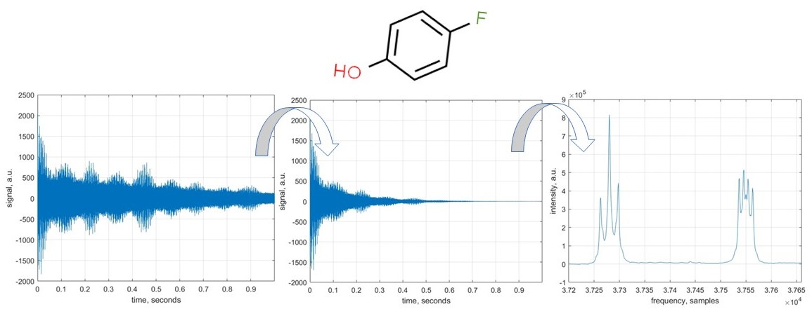
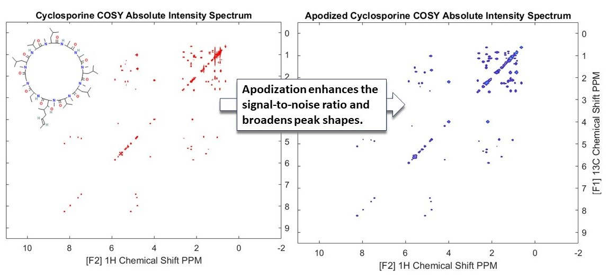

## 1. Import and plot Bruker Data

We begin by reading a 1H Bruker NMR data into MATLAB structures. A structure array is a data type that groups related data using data containers called fields. In this example we use rbnmr function to import the data. 

Download [rbnmr](https://www.mathworks.com/matlabcentral/fileexchange/40332-rbnmr) and add these two functions to this folder: "rbnmr.m" and "plotbnmr.m". 

These matlab functions are provided by Nils Nyberg. These functions make it easy to read Bruker format processed NMR data into the workspace memory of matlab and to plot the data. It supports one and two-dimensional data.

## 2. Initial processes on raw NMR data  

In this example, we import a sample NMR data and perform a few standard NMR data processing operations: DC offset correction, apodisation, zerofilling, and Fourier transform. The molecule we are dealing with is 4-fluorophenol, a common pharmaceutical precursor. 

## 3. Error correction in NMR  

Radiofrequency hardware used to record NMR spectra is not perfect; its principal non-ideality is finite response time: resonant circuits operating at NMR frequencies (hundreds of MHz) take a few microseconds to switch between transmit and receive modes. This introduces three types of distortions: Baseline error, Frequency-independent phase error, and Frequency-dependent phase error. 

In this example, we will learn how to correct all three types of distortions. The molecule we are dealing with here is ethyl crotonate, a plasticiser for acrylic resins; we will be looking at its proton NMR spectrum.

## 4. NMR Signal Integration   

Area under each NMR signal is proportional to the number of nuclei contributing to that signal. Therefore, signal integration allows for quantitative analysis of mixtures. For example, in a molecule like ethanol, integration can reveal hydrogen atom counts in different functional groups (CH3, CH2, OH). 

In this interactive example, we select areas of interest on a sample NMR spectrum of ethyl crotonate and use trapezium rule for the numerical integration, as illustrated in the above figure. 

The presented approach finds the corresponding array index extents which allows automated quantification to handle large number of spectra databases.

## 5. 1D NMR peak fitting   

In this example we introduce 1D peak fitting using a linear combination of Lorentzian functions. Fitting is important, because it can be used to quantify the signal parameters which hold information on the molecular makeup of the sample. We selected the peaks we want to fit in the spectrum and used an optimization algorithm which finds the best parameters for our model.

## 6. Processing 2D NMR COSY   

In this example, we have explored the processing of 2D NMR COSY (Correlation Spectroscopy) spectra using Cyclosporine as an example. 

COSY experiments are instrumental in revealing couplings between homonuclear nuclei (like hydrogen atoms) in a molecule. These couplings are manifested as cross peaks in the spectra, providing critical insights into the molecular structure. We have demonstrated how the absolute values of the spectra can be used to show the peaks. In addition to being enhanced with appropriate apodization functions. In this case we have used an exponential decay function to make the weaker peaks more prominent (see the above figure).  

## 7. Processing 2D NMR NOESY   

In this example, we have introduced the Nuclear Overhauser Effect Spectroscopy (NOESY). This technique plays a crucial role in elucidating the spatial arrangement of atoms within a molecule, particularly in the study of biomolecules like proteins and nucleic acids.

To interpret the NOESY spectra the time domain data needs to be processed so we can identify the individual peaks. This is done by enhancing signals through apodization and phase correction. Applying phase correction on both dimensions of the spectrum makes the cross peaks more easily visible. (see the above figure).

## 8. Mnaual Processing of 2D NMR HSQC   

Many NMR processing software have automatic phase correction algorithms, but often phase correction needs to be manually applied by the user. 

In this example we will explore manual phase correction to improve the quality of a Heteronuclear Single Quantum Coherence (HSQC) experiment. 

HSQC is a sophisticated two-dimensional NMR technique that plays a crucial role in the study of molecular structures. It is termed 'heteronuclear' because it involves interactions between two different types of nuclei, typically 1H,13C or 15N. The 'single quantum coherence' aspect refers to the quantum mechanical coherence between nuclear spins, which is central to the experiment.  

Starting from the time domain we applied apodization and interactively phase corrected our entire spectra. This was done by selecting a reference peak and extracting 1D FIDs from the peak center (One for F1 and one for F2 dimensions). Then phase correction was applied interactively to select 0th and 1st order phase corrections. Once we found a good 0th and 1st order correction we applied it to the entire spectrum. 

## 9. Import and Visualize 3D HNCA NMR   

In this example 3D NMR experiments have been introduced and we discuss how they can be used to study large biomolecular structures. This is especially important in the analysis of large proteins which contain many amino acids, whose signals in standard 1D and 2D experiments would cause crowding and overlap. The extension of the experiment into the third dimension allows one to encode more information. In this tutorial the HNCA spectra was imported and its use in  protein backbone assignment briefly outlined.
 
Visualisation of 3D spectra can be difficult. We have shown how this can be roughly done with three dimensional surface plots. However, more commonly 2D slices at particular dimensions are extracted and analysed as if a 2D spectra. 

## 10. Processing 3D NMR Spectrum   

In this example we import and process 3D spectrum of a HNCA experiment on GB1. Phase correction was manually applied to all three dimensions interactively. 

The 0th and 1st order values were chosen by isolating a reference peak as a 3D cube of data and values chosen so that the 1D FID is correctly centered in all three dimensions. Visualizing 3D spectra is difficult, and this was achieved by extracting 2D slices at 1H-13C and 1H-15N dimensions. The impact of phase correction can be seen in these slices, especially in the shoulder peaks in the Carbon domain. These line shapes are dependent on amino acids generating these signals and can be used to assign each residue. 3D NMR plays a critical role in determining protein structure and dynamics.

In this example we processed the spectrum, so it is ready for further analysis and backbone assignment of the protein.

### Usage

All the codes can be opened in [MATLAB® Online™](https://matlab.mathworks.com/).

### Acknowledgment

All the Data files used in these examples are kindly provided by Prof. Ilya Kuprov from University of Southampton.

